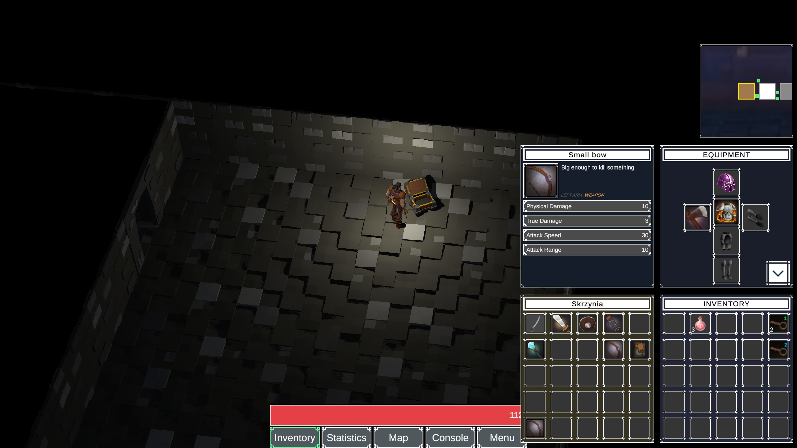
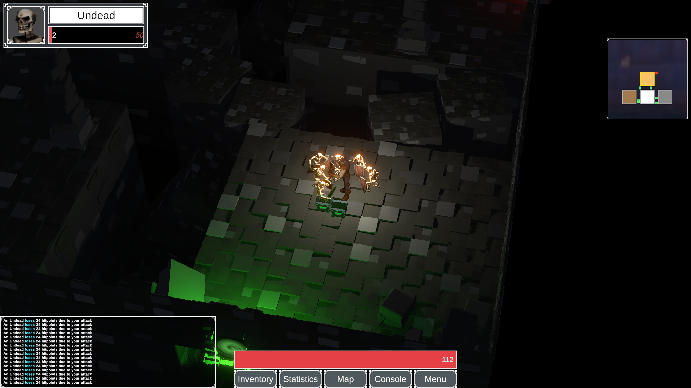
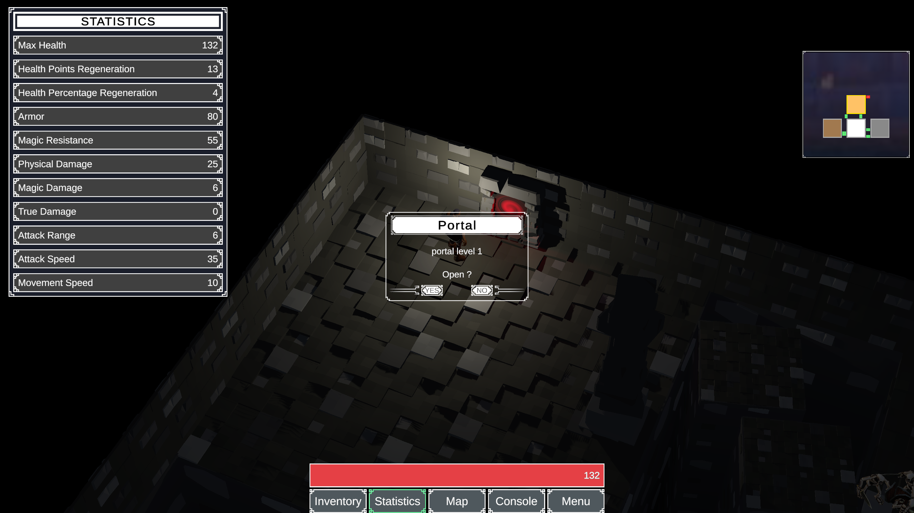
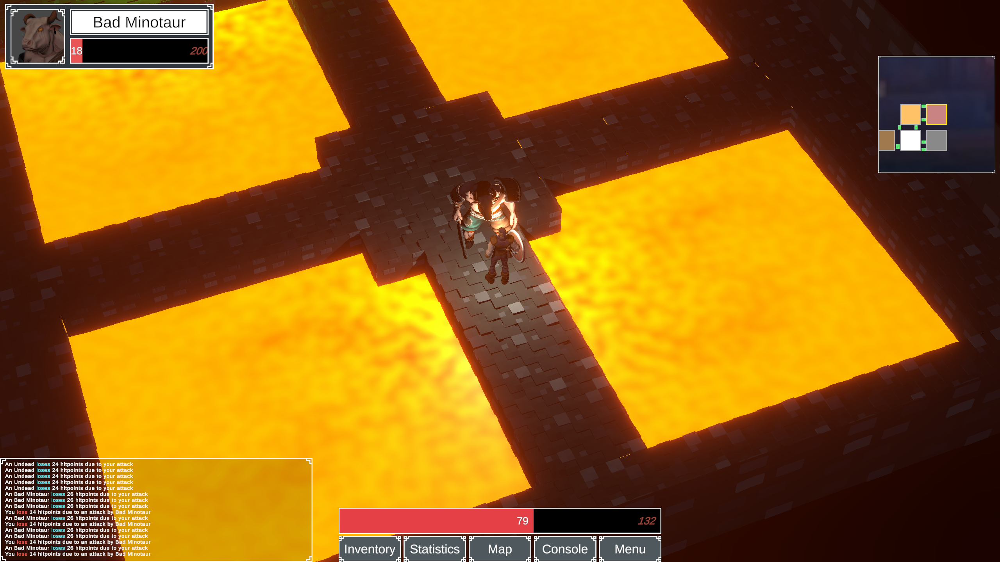
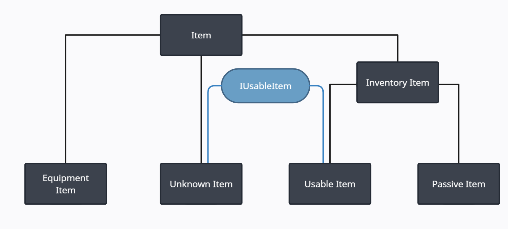

<h1>The 100 Floors</h1>

<table>
<tbody>
  <tr>
    <td></td>
    <td></td>
  </tr>
  <tr>
    <td></td>
    <td></td>
  </tr>
</tbody>
</table>

<h2>CONTROLS</h2>

<ul>
    <li>Q - Rotate Camera Left</li>
    <li>E - Rotate Camera Right
    <li>Scroll - Zoom in / Zoom Out</li>
    <li>LMB - Inspect</li>
    <li>RMB - Move</li>
    <li>Tab - Inventory / Equipment</li>
    <li>I - Statistics</li>
    <li>M - Map</li>
    <li>C - Console</li>
    <li>Esc - Pause</li>
</ul>

<h2>ABOUT - GAME</h2>

The 100 Floors is a dungeon crawler where player goal is to reach 100th floor of dungeon. 
    At the end of each floor there is a boss that the player must defeat to get to the next floor. 
    Player can aquire equipment items (armors, weapons) and inventory items (keys to portals, potions increasing statistics). 
    As the game progresses, the game's difficulty level increases. Enemies are harder to defeat, floors contain more rooms but better items appear to help.

<h2>ABOUT - PROJECT</h2>
<ul>
    <li>Rooms are generated randomly, but generator bases on scriptable objects which contain informations about list of room prefabs are available to spawn on current floor</li>
    <li>Each room uses Portal spawner to spawn portal between rooms. Spawner does it in two ways: randomly in wall or in prepared spots</li>
    <li>Chest rooms and fight rooms uses spots and planes to spawn chests and enemies</li>
    <li>Items are classified according to a scheme
      
        <ul>
            <li>Unknown Items - items have to be identified. After that process unknown item disappear and loot manager spawns loot bag with new item (it may be either a equipment item or a inventory item)</li>
            <li>Passive Items - inventory items (mostly keys) which are used during interaction with objects e.g. doors</li>
            <li>Usable Items - inventory items (mostly potions) which are used by player manually</li>
            <li>Equipment Items are classified by equipment slot category (HEAD, BODY, LEGS, FEET, RIGHT ARM, LEFT ARM). Weapons can be classified to right or left armm slot and player can only hold one weapon. 
                However there are items that can be hold in mentioned slots but due to they are not marked as a weapons - you can hold them in the second slot, while you hold wepaon item in the first slot</li>
            <li>Items classified as weapons are spawned and they are used by a character model in game. Player character wear weapon on the back out of combat and use it when combat is on. Additionally, depending on the weapon attack type (FISTS, SWORD, WAND, SPELL, BOW) - attack animation is changing</li>
        </ul>
    </li>
          
  <li>The game includes a buff system. Buffs increase or decrease a player's statistics</li>
  <li>Buff system prevents to gain buff if player gained buff in the same category (e.g. attack range). However if decreasing buff is active, player can gain increasing buff in the same category</li>
  <li>The game does not contain character classes but players can build their character using appropriately items. For example if you want to be a acrher, suit up equipment increasing attack range and physical damage instead of movement speed and magic damage. This also applies to potions</li>
  <li>Physcial damages and magic damages are calculated by damage multipliers (attack_value * damage_multiplier).
     Respectively: pDM = 100/(100 + armor), mDM = 100/(100 + magic_resistance)</li>
  <li>Enemies also use the statistics system, so some opponents can be defeated more easily by using physical attacks and some by using magic damage</li>
  <li>The gameplay is saved when teleporting to the next level (after killing the boss and using the teleport). Saving progress takes into account the player's equipment and inventory but also active buffs and debuffs</li>
  </ul>
